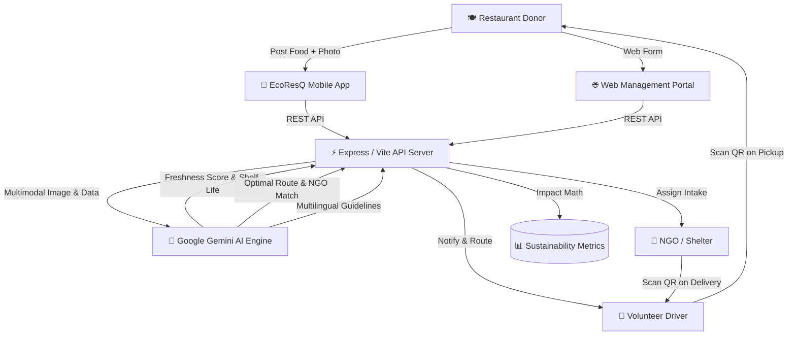

# 🍃 EcoResQ — Smart AI Food Rescue & Waste Management System

[](https://reactnative.dev/)
[](https://expo.dev/)
[](https://nodejs.org/)
[](https://ai.google.dev/)
[](https://www.typescriptlang.org/)
[](https://vitejs.dev/)

> An end-to-end full-stack smart food rescue platform powered by **Google Gemini AI**, **React Native (Expo)**, and **Node.js/Express**. EcoResQ bridges the gap between surplus food donors (restaurants, caterers) and recipients (NGOs, shelter homes) with real-time AI quality prediction, smart volunteer matching, QR pickup authentication, and sustainability analytics.

---

## 📌 Table of Contents
- [Problem & Vision](#-problem--vision)
- [Key Features](#-key-features)
- [System Architecture](#-system-architecture)
- [Tech Stack](#-tech-stack)
- [Mobile App (Expo Go & Android)](#-mobile-app-expo-go--android)
- [Getting Started](#-getting-started)
- [Demo Credentials](#-demo-credentials)
- [AI Engine Capabilities](#-ai-engine-capabilities)
- [Deployment Guide](#-deployment-guide)

---

## 🌍 Problem & Vision

Every day, millions of tons of edible food are discarded while thousands face food insecurity. Key bottlenecks include:
1. **Safety uncertainty:** Fear of spoiled food liability.
2. **Logistics delays:** Mismatch between donor preparation time and volunteer availability.
3. **Lack of verification:** Fraudulent claims and untracked handovers.

**EcoResQ** solves these challenges using **multimodal Gemini Vision AI** to verify food safety in seconds, route logistics intelligently, and verify handovers transparently.

---

## 🚀 Key Features

### 1. 🔍 AI Food Safety & Freshness Prediction
* Multimodal photo analysis using **Google Gemini Vision**.
* Computes real-time **Freshness Score (0–100%)**, remaining shelf life (in hours), and microbial safety guidelines conforming to **FSSAI & HACCP standards**.

### 2. 🤖 Smart Logistics & Proximity Matching Engine
* Automatically pairs donations with the best NGO and nearby volunteer based on travel distance, vehicle capacity, and rescue urgency score.

### 3. 🌐 Multilingual AI Rescue Assistant (Tamil & English)
* Built-in interactive AI assistant supporting both **English** and **Tamil (தமிழ்)** to guide donors and volunteers on food storage and legal donation regulations.

### 4. 📲 Dual Platform (Mobile App + Web Portal)
* **Mobile App (React Native/Expo):** Designed for volunteers on the move and on-site restaurant staff.
* **Web Dashboard (React/Vite):** Full operational command center for NGOs and Administrators.

### 5. 🔐 Secure QR Code Handover Verification
* Camera-based QR verification ensuring transparent, verifiable chain of custody during pickup and drop-off.

### 6. 🌱 Carbon & Environmental Impact Analytics
* Real-time calculation of **CO₂e prevented**, **water conserved (liters)**, and **methane emissions averted**.

---

## 🏛️ System Architecture



---

## 🛠️ Tech Stack

| Layer | Technology |
| :--- | :--- |
| **Mobile App** | React Native (0.76.5), Expo (SDK 52), TypeScript, React Navigation 7, Expo Camera, Expo Location |
| **Web Frontend** | React 19, Vite 6, Tailwind CSS 4, Lucide React, Motion |
| **Backend API** | Node.js, Express, TSX, REST APIs |
| **AI / ML** | Google Gemini 3.6 Flash (`@google/genai`) |
| **Database** | Persistent JSON Store (`data/users.json`, `data/donations.json`) |

---

## 📱 Mobile App (Expo Go & Android)

The mobile application is located in the [`mobile/`](./mobile) folder and includes 9 complete screens:
* **Splash & Multi-Role Auth:** Fast switching between Donor, NGO, Volunteer, and Admin personas.
* **Live Rescue Feed:** Real-time food listings with urgency badges.
* **Smart Donation Flow:** Camera capture + live AI inspection.
* **Interactive Map:** Geospatial visualization of rescue pins and routes.
* **QR Scanner:** In-app camera scanner for verification.
* **Multilingual AI Chatbot:** English and Tamil food safety assistance.
* **Sustainability Analytics:** Carbon savings and metrics.
* **Profile Management:** Verification status and rescue history.

---

## ⚡ Getting Started

### Prerequisites
* [Node.js](https://nodejs.org/) (v18 or higher)
* [Expo Go](https://expo.dev/go) app installed on your Android/iOS phone

### 1. Clone Repository
```bash
git clone https://github.com/HARIHARANk2007/smart-_food_waste_management.git
cd smart-_food_waste_management
```

### 2. Configure Environment Variables
Create a `.env` file in the root folder:
```env
GEMINI_API_KEY="your_google_gemini_api_key"
PORT=3000
```
*(Note: If no API key is provided, the system automatically uses built-in realistic AI fallbacks).*

### 3. Run Backend & Web Portal
```bash
npm install
npm run dev
```
Open **`http://localhost:3000`** in your browser.

### 4. Run Mobile App
Open a second terminal window:
```bash
cd mobile
npm install
npm start
```
* **Android:** Open **Expo Go** → Tap **"Scan QR code"** → Scan the QR code shown in the terminal (or enter `exp://<YOUR_LOCAL_IP>:8081`).
* **iOS:** Open default **Camera** app → Scan QR code → Tap **"Open in Expo Go"**.

---

## 👥 Demo Credentials

| Role | Email | Password |
| :--- | :--- | :--- |
| 🍳 **Restaurant Donor** | `restaurant@ecoresq.demo` | `demo123` |
| 🏢 **NGO Receiver** | `ngo@ecoresq.demo` | `demo123` |
| 🛵 **Volunteer Driver** | `volunteer@ecoresq.demo` | `demo123` |
| 🛡️ **Operations Admin** | `admin@ecoresq.demo` | `demo123` |

---

## 🚢 Deployment Guide

### 🌐 Deploy Backend & Web (Render.com)
1. Fork / push this repository to your GitHub.
2. Sign up at [Render.com](https://render.com) and create a **New Web Service**.
3. Connect your GitHub repository:
   * **Build Command:** `npm install && npm run build`
   * **Start Command:** `npm start`
4. Add environment variables:
   * `GEMINI_API_KEY`: *(Your Gemini API key)*
   * `NODE_ENV`: `production`

### 📱 Build Standalone Android APK (Expo EAS)
```bash
npm install -g eas-cli
eas login
cd mobile
eas build -p android --profile preview
```

---

## 📄 License
This project is open source and available under the [MIT License](LICENSE).
